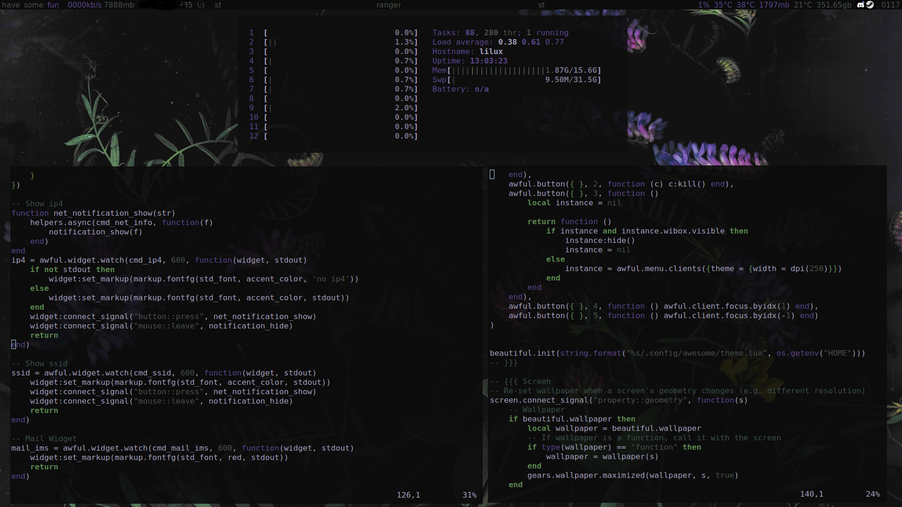
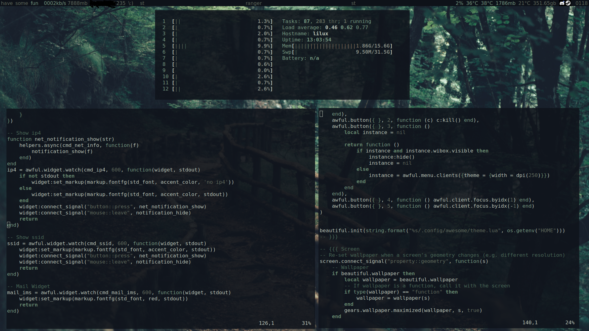
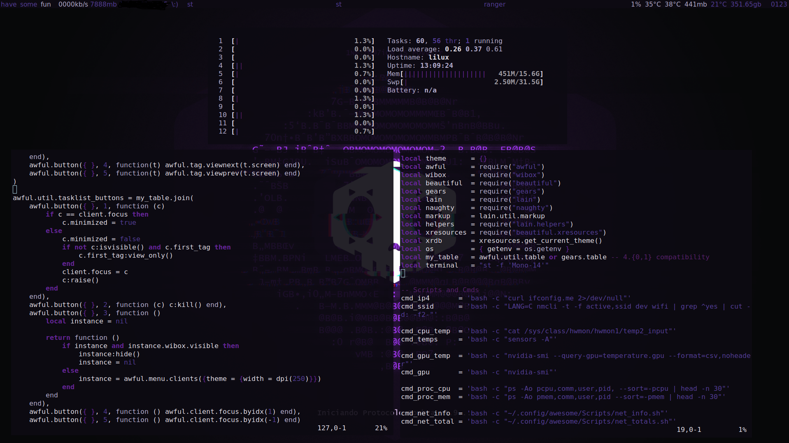
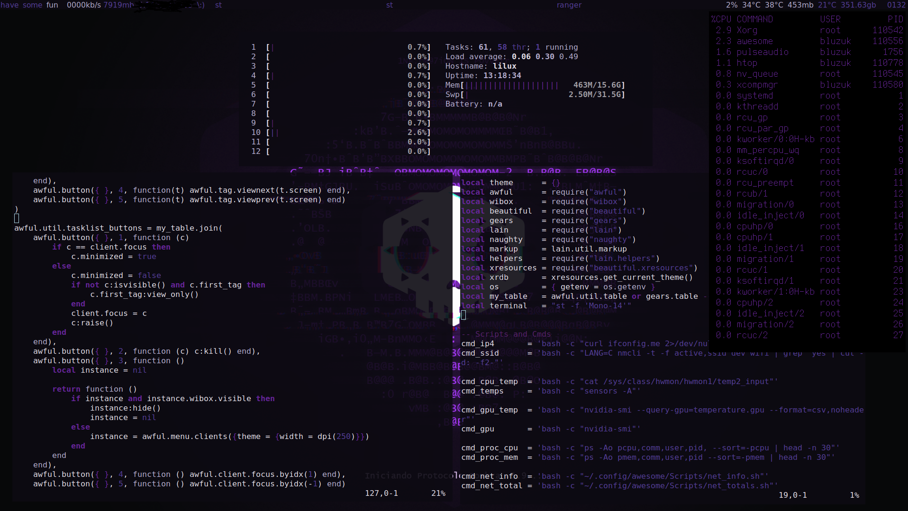

# Awesome WM Config

Awesome WM Config using [Pywal](https://github.com/dylanaraps/pywal).

```lua
local xresources = require("beautiful.xresources")
local xrdb       = xresources.get_current_theme()
```





